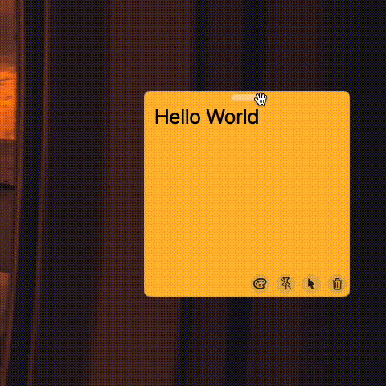

# WinToEdge
A macOS library that handles window to screen edge

## Install
In your macOS project, **File** -> **Add Package Dependencies ...**, search `https://github.com/boybeak/WinToEdge.git`

## Usage
```swift
onHover: { hovering in
    if hovering {
        self.window?.escapeFromEdge(edges: [.left, .right])
    } else {
        self.window?.catchToEdge(edges: [.left, .right])
    }
}
```

